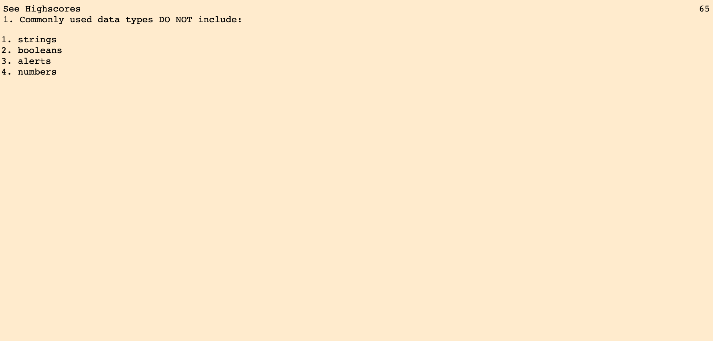

## Java Code Quiz
This repository contains code  for Rutgers Coding Bootcamp's fourth challenge homework, WEB APIs.

For this challenge, we were tasked to make a timed, five question quiz. Each time a user selects a wrong answer, the timer will go down. The quiz will end after the user answers all the questions OR if they run out of time.

At the end of the quiz, users are given the option to leave their initials and have their scores recorded.

Here's a preview of the website!

## Website
You can visit the Website here!

https://ronnieve23.github.io/JavaCodeQuiz/
